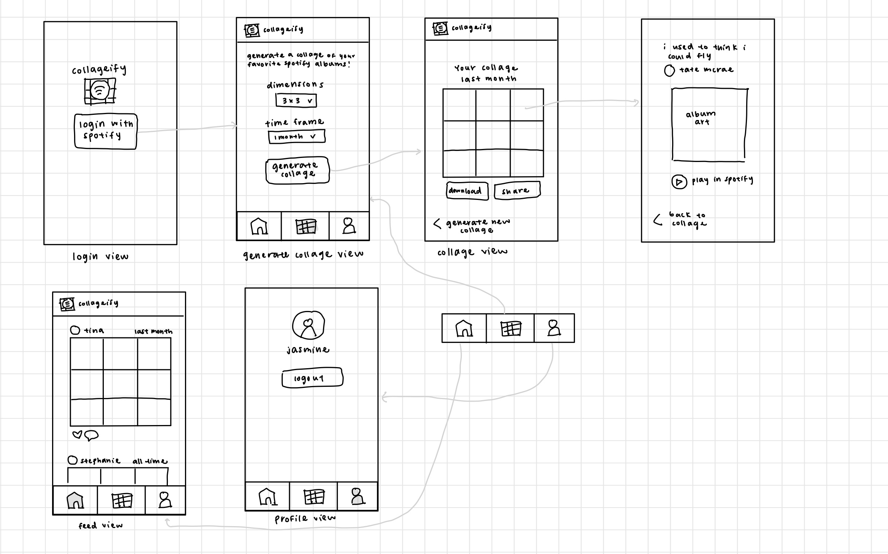

MetaU Capstone Project
===

# Collageify

## Table of Contents
1. [Overview](#Overview)
1. [Product Spec](#Product-Spec)
1. [Wireframes](#Wireframes)
2. [Schema](#Schema)

## Overview
### Description
An app that creates collages based on your listening history on Spotify. 

### App Evaluation

- **Category:** Entertainment
- **Mobile:** Not super uniquely mobile, although might be able to incorporate feature that plays music through Spotify app
- **Story:** Could be fun for Spotify listeners to see a visual representation of their top artists and songs and potentially share with friends
- **Market:** Spotify listeners (406 million monthly active listeners as of 2022)
- **Habit:** Typical user may be inclined to check the app once per month to see how their listening history has changed, though users could check more or less frequently as desired
- **Scope:** The Spotify API provides lots of helpful information, which makes the project seem feasible within the time available. A stripped-down version would still be interesting to build and use, and stretch features could be challenging

## Product Spec

### 1. User Stories (Required and Optional)

**Required Must-have Stories**

* Sign in with Spotify account
* Generate collage of album images based on listening history 
* Select time frame of data to be used (1 month, 6 months, or all time)
* Tap on an image within the collage to open a more detailed page with information about that album
* Share collage (via text, email, Google Drive...)
* Post collage to feed, where users can also see other people's posts
* Users can see their own posted collages on their profile

**Optional Nice-to-have Stories**

* Play a song from collage through Spotify (on details screen of that song)
* Calculate and show stats for collage on details screen (like energy or valence, which can indicate mood)
* Post collage with a caption
* Like posts
* Comment on posts

### 2. Screen Archetypes

* Login
   * Sign in with Spotify account
* Collage screen
   * Generate collage of song or artist images based on listening history (give both options)
    * Select time frame of data to be used (1 month, 6 months, or all time)
* Detail screen
    * Tap on a song or artist image within the collage to open a more detailed page with information about that artist or song
* Feed
    * View everyone's posts

**Optional Nice-to-have Screens**
* Share screen (add caption to collage before posting)

### 3. Navigation

**Tab Navigation** (Tab to Screen)

* Home
    * Main feed of posts
* Collage
    * Generate collage
* Profile
    * See own posted collages on their profile

**Flow Navigation** (Screen to Screen)

* Login
   * Sign in with Spotify to proceed to collage screen
* Collage Screen
   * Tap on an image within a collage to get to detail screen
* Detail Screen
   * Tap on back button to go back to collage screen

## Wireframes
[Add picture of your hand sketched wireframes in this section]



### [BONUS] Digital Wireframes & Mockups

### [BONUS] Interactive Prototype

## Schema 

### Models

**User**

| Property   | Type   | Description                                    |
|:---------- |:------ |:---------------------------------------------- |
| objectId   | String | Text                                           |
| updatedAt  | Date   | date when user is last updated (default field) |
| createdAt  | Date   | date when user is created (default field)      |
| password   | String | password for user to authenticate with         |
| username   | String | username for user to sign in with              |
| profilePic | File   | pulled from user's spotify account             |
| spotifyId  | String | user's unique spotify user id                  |

**Post**

| Property  | Type            | Description                                    |
|:--------- |:--------------- |:---------------------------------------------- |
| objectId  | String          | unique id for the post (default field)         |
| author    | Pointer to User | author of this post                            |
| image     | File            | collage image                                  |
| likedBy   | Array           | list of users who have liked this post         |
| updatedAt | Date            | date when post is last updated (default field) |
| createdAt | Date            | date when post is created (default field)      |


### Networking
Using combination of Parse database and Spotify API 

#### List of network requests by screen
- Signup Screen
    - (put) Create new ParseUser
    ```
    ParseUser user = new ParseUser()
    user.setUsername(username);
    user.setPassword(password);
    user.signUpInBackground()
    ```
- Login Screen
    - (get) Get ParseUser information upon login
    `ParseUser.logInInBackground(username, password)`
- Home Feed Screen
    - (get) Query all posts
    - (put) Like or unlike a post
    - (put) Comment on a post
- Collage Screen
    - (GET) Get data from Spotify API
    - (put) Post collage (if user decides to share)
- Profile Screen
    - (get) Query posts that the current user has posted
    - (get) Show user's profile picture


#### Existing API Endpoint
Spotify API
- Base URL: https://api.spotify.com/v1
    | HTTP Verb | Endpoint         | Description                                                              |
    |:--------- |:---------------- |:------------------------------------------------------------------------ |
    | GET       | /me              | get current user information                                             |
    | GET       | /users/{user_id} | get user profile information such as profile picture and Spotify user id |
    | GET       | /me/top/tracks   | get current user's top tracks                                            |


